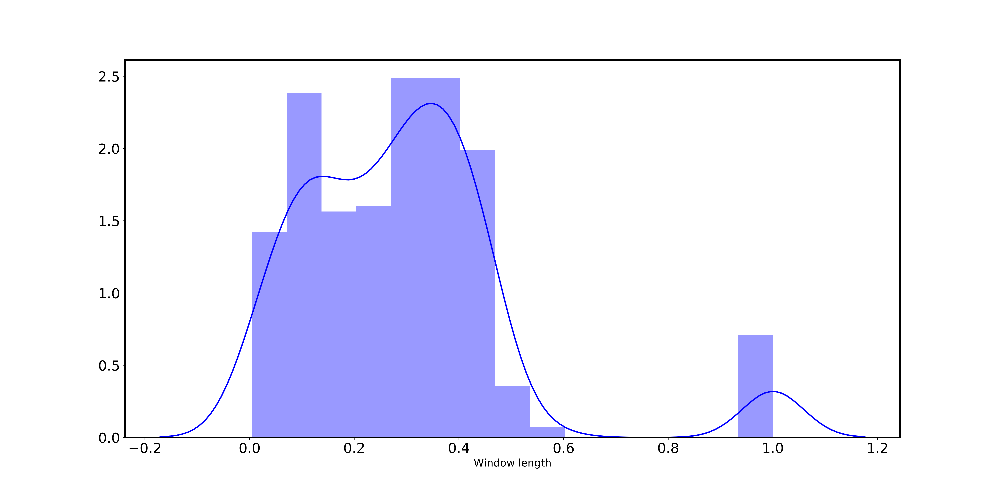
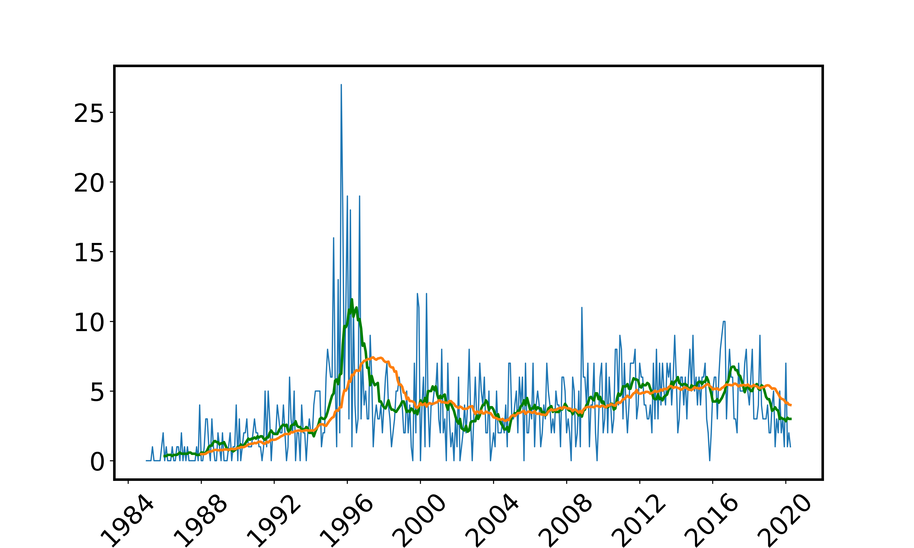
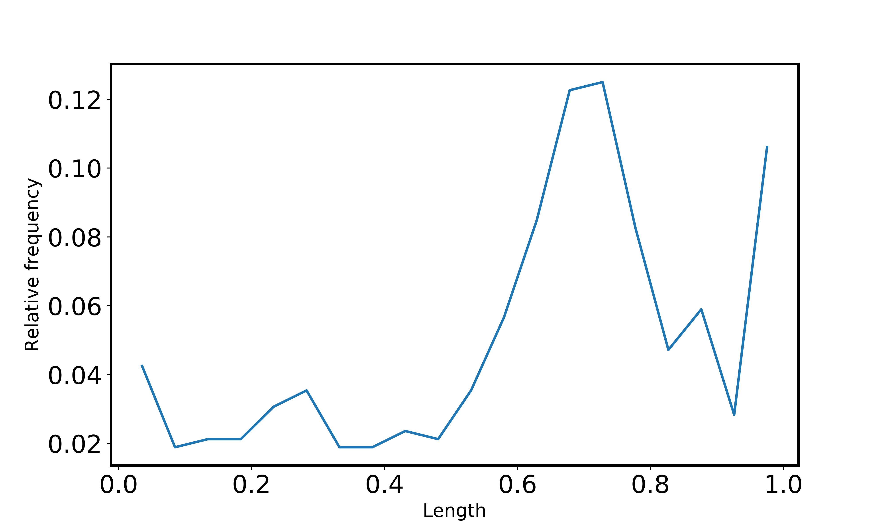
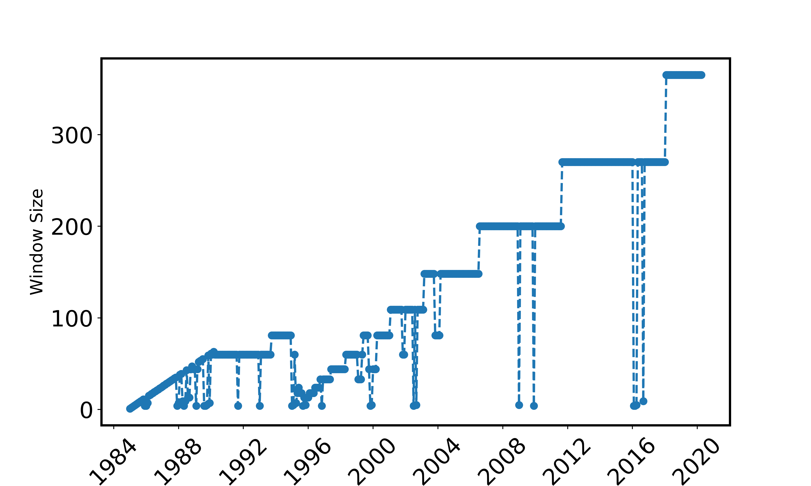
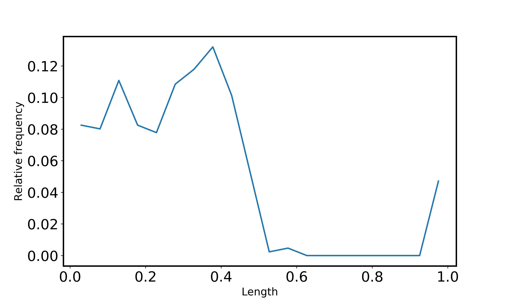
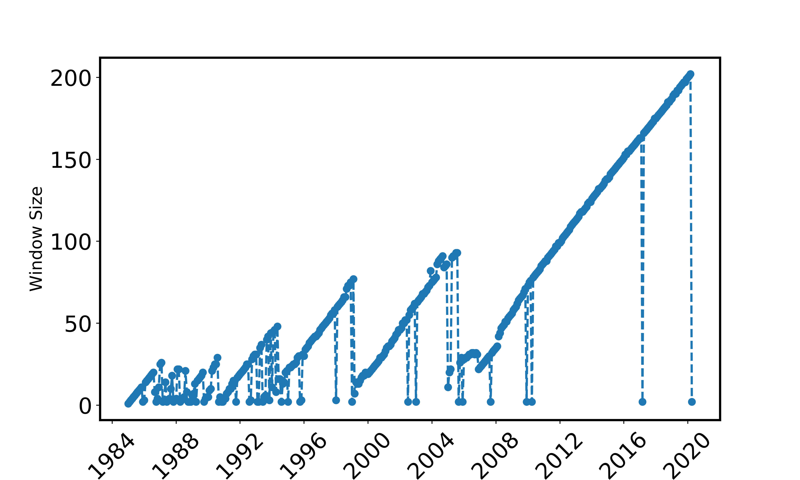
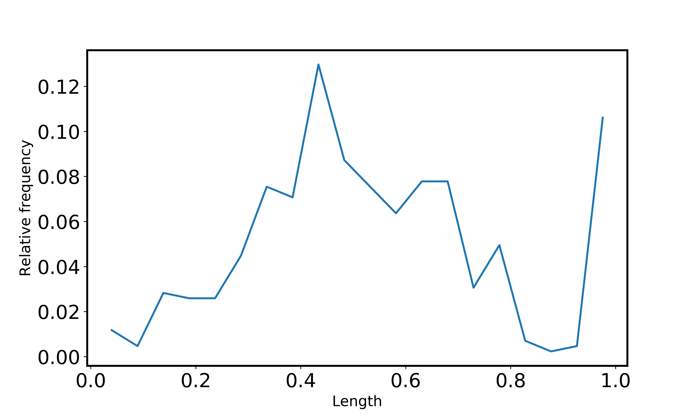
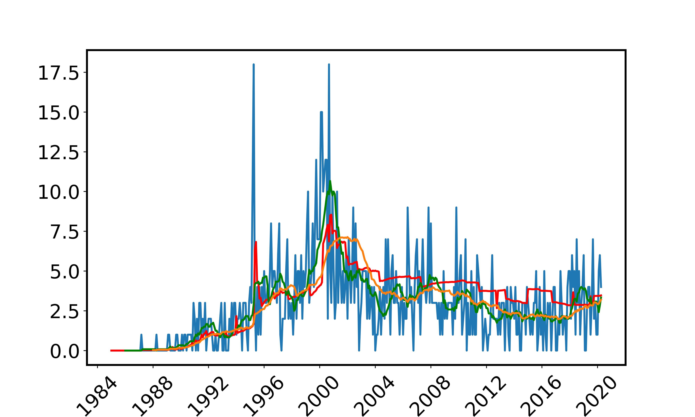
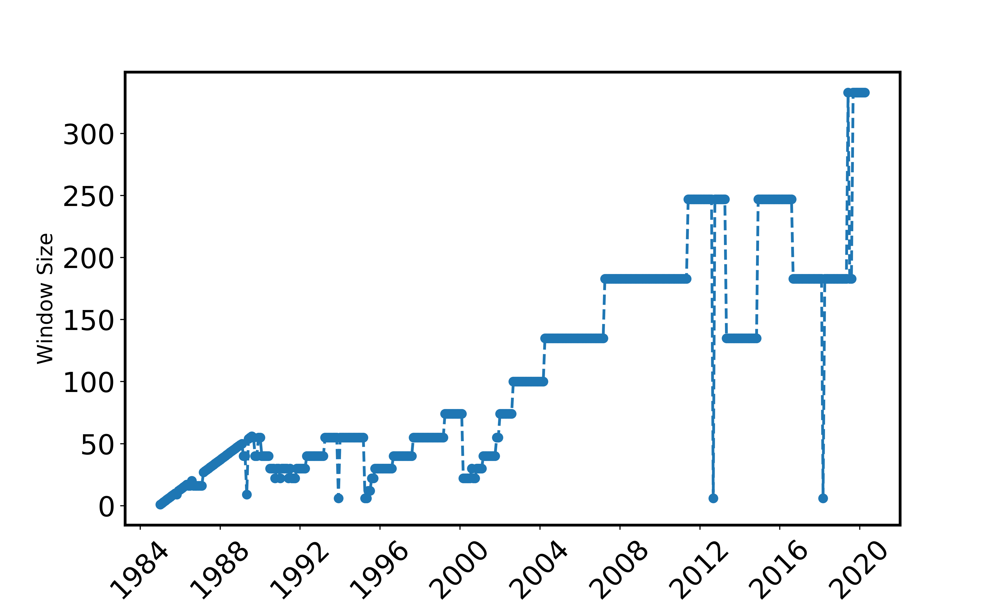

[](http://quantlet.de/)

## [](http://quantlet.de/) **LPA_Empiricalstudy** [](http://quantlet.de/)

```yaml

Name of QuantLet : 'LPA_Empiricalstudy'

Published in : 'data_driven_controlling' 

Description : 'Applies the local parametric approach to detect change points, regime shifts and structural breaks in real life datasets and then compares the estimates from fixed rolling window estimates and LPA approach using RMSE. It also provides all the plots. The data is however downloaded with special permissions from Thomson Reuters and is not publicly available. If you have permission to access the data, please get in touch with us with permission and we will share the data with you'

Keywords : 'mergers & acquisitions, mergers, acquisitions, deals, poisson, time series, decomposition, forecasting, prediction, economics, estimation, adaptive parameters'

Author : 'Kainat Khowaja'
```





















### [IPYNB Code: LPA_Empiricalstudy.ipynb](LPA_Empiricalstudy.ipynb)


automatically created on 2020-11-25